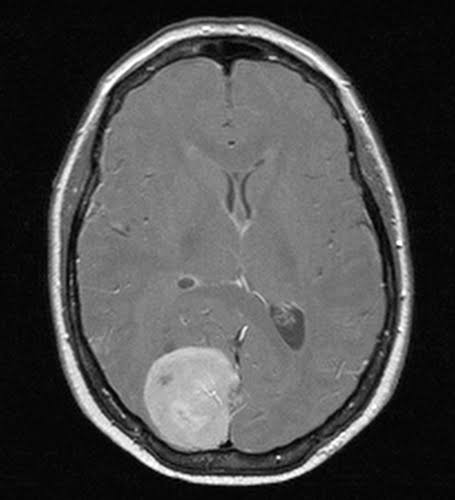

# Brain Tumor Classification with Vision Transformer

This project implements a Vision Transformer (ViT) model for brain tumor classification using PyTorch. The model classifies brain MRI images into four categories: glioma, meningioma, no tumor, and pituitary tumor using transfer learning from the pretrained google/vit-base-patch16-224 model.

## Dataset Overview

The dataset consists of MRI scans categorized into four classes:
- Glioma: A type of tumor that starts in the glial cells of the brain
- Meningioma: Tumors that arise from the meninges
- Pituitary: Tumors that affect the pituitary gland
- No Tumor: Normal brain MRI scans

The dataset was collected from [Kaggle](https://www.kaggle.com/datasets/masoudnickparvar/brain-tumor-mri-dataset) and the name of the dataset was `Brain Tumor MRI Dataset`. 
## Dataset Sample
- Glioma

   

- Meningioma

   

- Pituitary

   

- No Tumor

   

### Data Statistics
```
Training Set:
- Glioma: 826 images
- Meningioma: 822 images
- No Tumor: 395 images
- Pituitary: 827 images
Total: 2,870 images

Testing Set:
- Glioma: 100 images
- Meningioma: 115 images
- No Tumor: 105 images
- Pituitary: 74 images
Total: 394 images
```

### Sample Images
Each MRI scan is preprocessed to:
- Size: 224×224 pixels
- Channels: 3 (RGB)
- Format: JPEG

## Project Structure

```
Brain-Tumor-Detection/
├── data/
│   ├── Training/
│   │   ├── glioma/
│   │   ├── meningioma/
│   │   ├── notumor/
│   │   └── pituitary/
│   └── Testing/
│       ├── glioma/
│       ├── meningioma/
│       ├── notumor/
│       └── pituitary/
├── data_processing.py
├── model.py
├── train.py
├── eval.py
├── main.py
├── checkpoints/
└── results/
```

## Environment Setup

### Requirements
- Python 3.8+
- CUDA capable GPU (recommended)
- 8GB RAM minimum
- 10GB disk space for dataset and model checkpoints

### Dependencies
```
- torch>=1.9.0
- torchvision>=0.10.0
- transformers>=4.21.0
- numpy>=1.21.0
- Pillow>=8.3.1
- tqdm>=4.62.0
- matplotlib>=3.4.3
- scikit-learn>=0.24.2
- seaborn>=0.11.2
```

### Installation

1. Create a new conda environment:
```bash
conda create -n brain_tumor python=3.12
conda activate brain_tumor
```

2. Install PyTorch with CUDA support:
```bash
# For CUDA 11.x
conda install pytorch torchvision torchaudio cudatoolkit=11.3 -c pytorch

# For CPU only
conda install pytorch torchvision torchaudio cpuonly -c pytorch
```

3. Install other dependencies:
```bash
pip install transformers numpy pillow tqdm matplotlib scikit-learn seaborn
```

### Data Preparation

Download the dataset and organize it in the following structure:
```
data/
├── Training/
│   ├── glioma/
│   ├── meningioma/
│   ├── notumor/
│   └── pituitary/
└── Testing/
    ├── glioma/
    ├── meningioma/
    ├── notumor/
    └── pituitary/
```

## Usage

1. Prepare your data:
   - Place your training images in the `data/Training/` directory
   - Place your testing images in the `data/Testing/` directory
   - Each directory should have subdirectories for each class (glioma, meningioma, notumor, pituitary)

2. Data processing:
   ```bash
   python data_processing.py
   ```
3. Define the model architecture:
   ```bash
   python model.py
   ```
4. Train the model:
   ```bash
   python train.py
   ```
   The script will:
   - Load and preprocess the data
   - Train the Vision Transformer model
   - Save the best model and checkpoints
   - Generate evaluation metrics and visualizations

## Implementation Details

### Data Processing
The pipeline includes:
1. **Image Loading**: RGB format, maintaining aspect ratio
2. **Augmentation** (training only):
   - Random horizontal flipping (p=0.5)
   - Random rotation (±10 degrees)
   - Normalization (mean=[0.485, 0.456, 0.406], std=[0.229, 0.224, 0.225])
3. **Preprocessing**:
   - Resize to 224×224 pixels
   - Convert to tensor
   - Normalize using ImageNet statistics

### Model Architecture
The model uses the Vision Transformer (ViT) architecture:
- **Base Model**: `google/vit-base-patch16-224` (pretrained on ImageNet)
- **Architecture Details**:
  - Patch size: 16×16 pixels
  - Hidden dimension: 768
  - Number of heads: 12
  - Number of layers: 12
  - MLP size: 3072
  - Classification head: 4 classes (custom)

### Training Configuration
The training process uses a two-phase approach:

1. **Phase 1 - Classifier Training**:
   - Frozen backbone (pretrained weights)
   - Train only the classification head
   - Learning rate: 1e-3
   - Epochs: 10
   - Optimizer: AdamW
   - Weight decay: 1e-2

2. **Phase 2 - Fine-tuning**:
   - Unfreeze all layers
   - Learning rate: 1e-5
   - Epochs: 20
   - Optimizer: AdamW
   - Weight decay: 1e-2

Common settings:
- Batch size: 32
- Loss function: Cross-Entropy
- Device: GPU (CUDA) if available

## Evaluation and Results

### Training Monitoring
During training, the following metrics are tracked:
- Training loss
- Validation loss
- Training accuracy
- Validation accuracy

### Evaluation Metrics
The model is evaluated using:
   ```bash
   python evaluations.py
   ```
1. **Classification Report**:
   - Precision
   - Recall
   - F1-Score
   - Per-class accuracy

 ```bash
            

                  precision    recall  f1-score   support

         glioma       1.00      0.99      1.00       300
     meningioma       0.99      1.00      0.99       306
        notumor       1.00      1.00      1.00       405
      pituitary       1.00      0.99      1.00       300

       accuracy                           1.00      1311
      macro avg       1.00      1.00      1.00      1311
   weighted avg       1.00      1.00      1.00      1311

 ```

2. **Confusion Matrix**

   


### Output and Artifacts
The training process generates:
1. **Model Checkpoints**:
   - Best model weights (`checkpoints/best_model/`)
   - Training state (`checkpoints/training_checkpoint.pth`)
   
2. **Visualizations**:
   - Training/validation loss curves
   - Accuracy progression
   - Confusion matrix heatmap

3. **Performance Reports**:
   - Detailed classification metrics
   - Model predictions on test set

### Inference
To run inference on new images:
```python
from inference import BrainTumorPredictor

# Initialize predictor
predictor = BrainTumorPredictor(model_dir="checkpoints/best_model")

# Predict single image
result = predictor.predict_image("path/to/image.jpg", return_probs=True)
print(f"Predicted class: {result[0]}")
print("Class probabilities:", result[1])
```

Output Format: 
```
Predicted class: glioma
Class probabilities:
glioma: 0.9950
meningioma: 0.0012
notumor: 0.0035
pituitary: 0.0003
```
